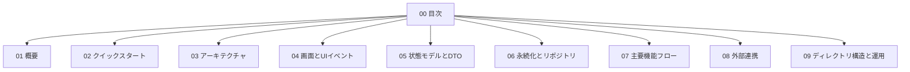

# 🧭 目次

OQOA の設計・運用に必要な情報をページ単位で整理しています。
はじめての方は [概要](./01-概要.md) → [クイックスタート](./02-クイックスタート.md) の順で読むとスムーズです。

## 📚 ページ一覧
- [📘 1. 概要](./01-概要.md)
- [🚀 2. クイックスタート](./02-クイックスタート.md)
- [🏗️ 3. アーキテクチャ](./03-アーキテクチャ.md)
- [🖥️ 4. 画面とUIイベント](./04-画面とUIイベント.md)
- [🧩 5. 状態モデルとDTO](./05-状態モデルとDTO.md)
- [💾 6. 永続化とリポジトリ](./06-永続化とリポジトリ.md)
- [🔁 7. 主要機能フロー](./07-主要機能フロー.md)
- [🔐 8. 外部連携](./08-外部連携.md)
- [📂 9. ディレクトリ構造と運用](./09-ディレクトリ構造と運用.md)

## 🗺️ 全体の見取り図


## 🔎 参照コード
参照: `src/app/app.ts:4-8`（コメントは説明用に追記）

```ts
// NOTE: 起動時に View と Controller を生成して開始する
async function start(): Promise<void> {
  const view = new View(document);
  const controller = new Controller(view);
  await controller.start();
}
```
