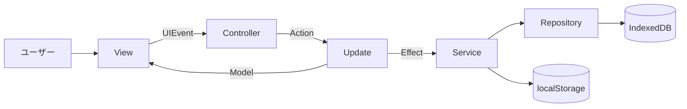

# 📘 1. 概要

## プロジェクト概要
OQOA（One Question One Answer）は一問一答形式の静的 Web アプリケーションです。
Google Drive から問題集データを取り込み、IndexedDB に解答履歴や問題集情報を保持します。

## 主な機能
- 問題集の演習
- 問題集一覧（検索）
- 設問一覧（検索）
- カスタム問題集の作成
- 演習履歴/設問履歴の確認
- Google Drive 連携によるインポート

## 技術スタック
- TypeScript 5.x
- Parcel
- Tailwind CSS
- ESLint
- IndexedDB / localStorage
- Google Identity Services / Google Drive API

## 全体像


## 関連リンク
- 詳細は [アーキテクチャ](./03-アーキテクチャ) を参照
- 起動手順は [クイックスタート](./02-クイックスタート) を参照

## 🔎 参照コード
参照: `src/app/controllers/controller.ts:39-42`（コメントは説明用に追記）

```ts
// NOTE: 起動時にハンドラ登録と初期化アクションを実行
async start(): Promise<void> {
  this.registerViewHandlers();
  this.dispatch({ type: Action.INIT });
}
```
