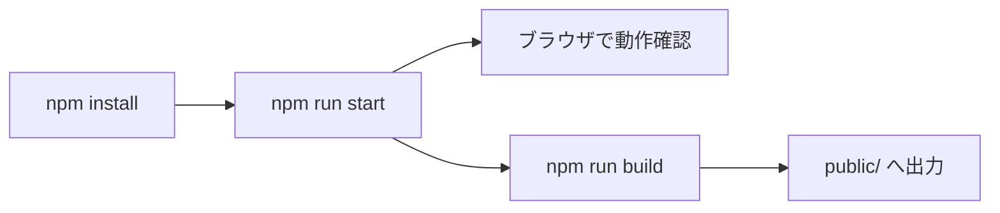

# 🚀 2. クイックスタート

## 前提
- Node.js と npm がインストール済みであること

## セットアップ
```sh
npm install
```

## 起動（開発）
```sh
npm run start
```

## ビルド
```sh
npm run build
```

## 静的解析
```sh
npm run lint
```

## 実行フロー


## 🔎 参照コード
参照: `package.json:4-9`（コメントは説明用に追記）

```jsonc
"scripts": {
  "prestart": "rimraf dist .parcel-cache", // キャッシュと dist の掃除
  "start": "parcel src/resources/index.html", // 開発サーバ
  "build": "parcel build src/resources/index.html --dist-dir public --public-url ./", // 静的ビルド
  "lint": "npx eslint .", // 静的解析
  "lint:fix": "npx eslint . --fix" // 可能な範囲で自動修正
}
```

## 関連リンク
- 全体像は [概要](./01-概要) を参照
- 運用の詳細は [ディレクトリ構造と運用](./09-ディレクトリ構造と運用) を参照
