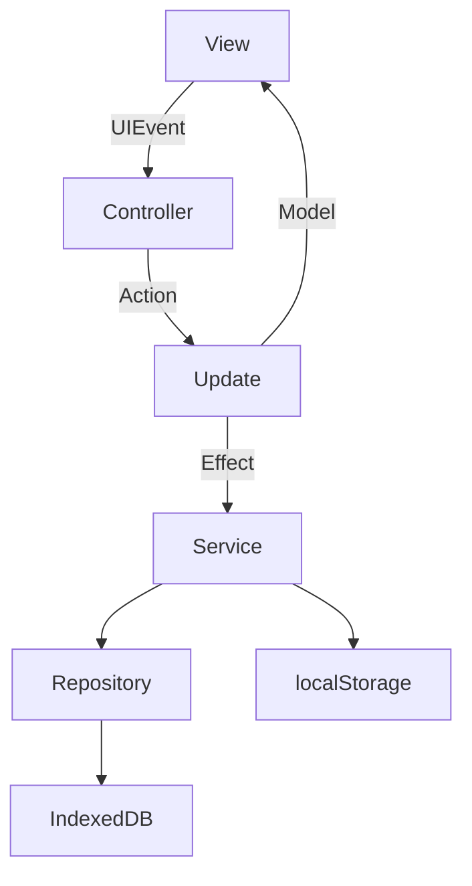

# 🏗️ 3. アーキテクチャ

## 構成方針
- MVU（Model-View-Update）を基盤に、Controller/Service/Repository を追加した構成
- View が UIEvent を発行し、Controller が Action に変換して Update を実行
- Update は Model 更新と副作用（Effect）を返し、Controller が実行

## レイヤ概要
| レイヤ | 役割 | 代表ファイル |
| --- | --- | --- |
| View | DOM 描画と UIEvent 発行 | `src/app/views/*` |
| Controller | UIEvent → Action 変換 / Effect 実行 | `src/app/controllers/controller.ts` |
| Update | Model 更新 / Effect 生成 | `src/app/updates/update.ts` |
| Service | ユースケース処理 | `src/app/services/*` |
| Repository | 永続化アクセス | `src/app/repositories/*` |
| Storage | localStorage 保持 | `src/app/storages/index.ts` |

## 処理フロー


## 関連リンク
- 状態定義は [状態モデルとDTO](./05-状態モデルとDTO.md) を参照
- 永続化の詳細は [永続化とリポジトリ](./06-永続化とリポジトリ.md) を参照

## 🔎 参照コード
参照: `src/app/controllers/controller.ts:217-222`（コメントは説明用に追記）

```ts
// NOTE: update → render → effect の順で処理する
private dispatch(action: ActionType): void {
  const { model, effects } = update(this.model, action);
  this.model = model;
  this.view.render(this.model);
  void this.execEffects(effects).catch(console.error);
}
```
