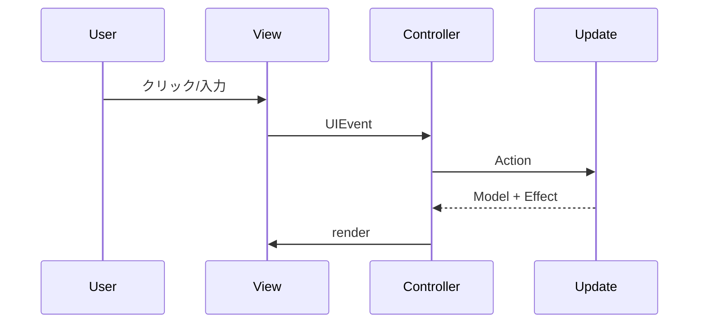

# 🖥️ 4. 画面とUIイベント

## 画面構成
- ヘッダー: アプリ名と設定/メニューのアイコン
- 問題集一覧: 標準のみフィルタと問題集カード
- 設問一覧: 検索バー、詳細検索、設問リスト
- サイドメニュー: 演習履歴（問題集/設問）
- モーダル/トースト: 設定、演習開始、設問詳細、通知

参照: `src/resources/index.html:14-214`

## UIイベントの流れ


## UIEvent 定義
イベント種別は `src/app/views/ui_event_types.ts:5-101` に定義されています。

## 関連リンク
- 全体設計は [アーキテクチャ](./03-アーキテクチャ.md) を参照
- 画面状態の詳細は [状態モデルとDTO](./05-状態モデルとDTO.md) を参照

## 🔎 参照コード
参照: `src/app/views/index.ts:121-156`（コメントは説明用に追記）

```ts
// NOTE: DOMイベントを UIEvent に変換して emit する
this.els.settingBtn.addEventListener("click", () => {
  this.emit(UIEvent.CLICK_SETTING_BTN, undefined);
});
this.els.menuBtn.addEventListener("click", () => {
  this.emit(UIEvent.CLICK_MENU_BTN, undefined);
  this.showSideMenuContent();
});
this.els.sideMenuCloseBtn.addEventListener("click", () => {
  this.hideSideMenuContent();
});
this.els.historyForPracticeBtn.addEventListener("click", () => {
  this.emit(UIEvent.CHANGE_HISTORY_ACTIVE_TAB, {
    activeTab: HistoryActiveTab.PRACTICE,
  });
  this.toggleHistoryTab(
    this.els.historyForPracticeBtn,
    this.els.historyForQuestionBtn,
  );
});
this.els.historyForQuestionBtn.addEventListener("click", () => {
  this.emit(UIEvent.CHANGE_HISTORY_ACTIVE_TAB, {
    activeTab: HistoryActiveTab.QUESTION,
  });
  this.toggleHistoryTab(
    this.els.historyForQuestionBtn,
    this.els.historyForPracticeBtn,
  );
});
this.els.qListsStandardCheckBox.addEventListener("change", () => {
  this.emit(UIEvent.TOGGLE_QLISTS_STANDARD_CHECK, {
    standardOnly: this.els.qListsStandardCheckBox.checked,
  });
});
this.els.createCustomQListBtn.addEventListener("click", () => {
  this.emit(UIEvent.CLICK_CUSTOM_PRACTICE_START, undefined);
});
```
