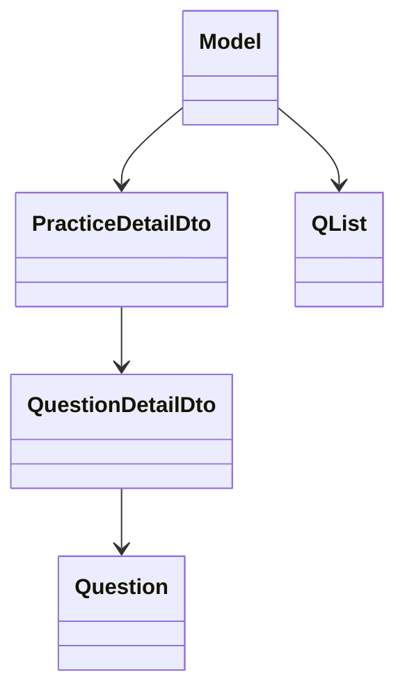

# 🧩 5. 状態モデルとDTO

## Model 概要
Model は画面表示に必要な状態を集約し、Update の結果として常に差し替えられます。

## Entity / DTO / Form
| 種別 | 役割 | 代表 |
| --- | --- | --- |
| Entity | ドメインの最小単位 | Question, QList, PracticeHistory, AnsHistory, Favorite |
| DTO | 画面向けの集約 | PracticeDetailDto, QuestionDetailDto, PracticeHistoryDto, AnsHistoryDto |
| Form | 検索条件 | QuestionSearchForm, QListSearchForm, PracticeHistorySearchForm, AnsHistorySearchForm |

DTO の詳細は `src/app/models/dtos/practice_detail_dto.ts:5-9` と `src/app/models/dtos/question_detail_dto.ts:3-7` を参照してください。

## 関係図


## 関連リンク
- 演習フローは [主要機能フロー](./07-主要機能フロー.md) を参照

## 🔎 参照コード
参照: `src/app/models/index.ts:18-42`（コメントは説明用に追記）

```ts
// NOTE: 画面状態は Model に集約される
export interface Model {
  theme: Theme;
  toastMessages: ToastMessage[];

  googleClientId: string | null;
  googleFolderId: string | null;

  defailtModalKind: ModalKindType | null;
  preparePracticeStart: QList | CustomPracticeStartDto | null;
  editQList: QList | null;
  questionDetailDto: QuestionDetailDto | null;

  qLists: QList[];
  qListSearchForm: QListSearchForm;
  questions: Question[];
  questionSearchForm: QuestionSearchForm;

  practiceDetailDto: PracticeDetailDto | null;

  historyActiveTab: HistoryActiveTab;
  practiceHistoryDtos: PracticeHistoryDto[];
  practiceHistorySearchForm: PracticeHistorySearchForm;
  ansHistoryDtos: AnsHistoryDto[];
  ansHistorySearchForm: AnsHistorySearchForm;
}
```
