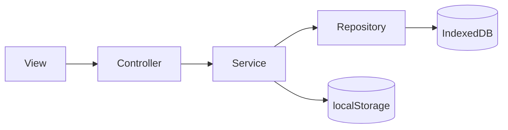

# 💾 6. 永続化とリポジトリ

## IndexedDB
IndexedDB は Repository 経由で操作され、初期化時にストアが作成されます。

### ストア一覧
| store | repository | entity |
| --- | --- | --- |
| ans_history | ans_history_repository | AnsHistory |
| favorite | favorite_repository | Favorite |
| practice_history | practice_history_repositoriy | PracticeHistory |
| q_list | qlist_repositoriy | QList |

※ 設問は `src/app/repositories/question_repositoriy.ts:3-58` のメモリ内リポジトリで保持します。

## localStorage
クライアント設定とインポート結果のキャッシュを localStorage に保持します。
参照: `src/app/storages/index.ts:6-65`

## 永続化フロー


## 関連リンク
- 全体設計は [アーキテクチャ](./03-アーキテクチャ) を参照

## 🔎 参照コード
参照: `src/app/services/indexeddb_service.ts:7-16`（コメントは説明用に追記）

```ts
// NOTE: DB 初期化時に各ストアを作成する
export async function initDatabase(): Promise<void> {
  return new Promise((resolve, reject) => {
    const request = indexedDB.open(DB_NAME, DB_VERSION);

    request.onupgradeneeded = (event: IDBVersionChangeEvent) => {
      ansHistoryRepository.initStore(event);
      favoriteRepository.initStore(event);
      practiceHistoryRepository.initStore(event);
      qListRepository.initStore(event);
    };
```
