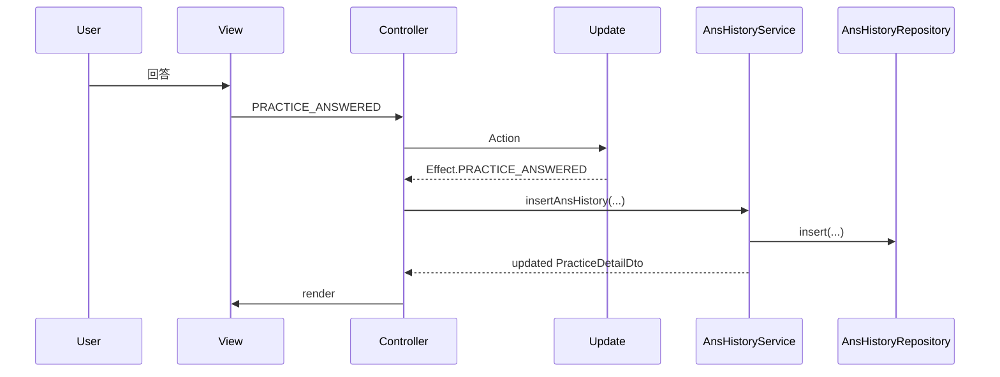

# 🔁 7. 主要機能フロー

## 演習フロー
1. 問題集カードを選択し、`Effect.PREPARE_PRACTICE_START` を実行
2. 演習開始時に `practice_sevice.generatePracticeDetailDto` で出題を生成
3. 回答確定で `ans_history_service.insertAnsHistory` を呼び、履歴を保存
4. 全問回答後に `practice_sevice.doPracticeComplete` で完了状態へ

参照: `src/app/services/practice_sevice.ts:20-120`

## 検索フロー
- 設問検索は `question_service.selectQuestionsForSearchForm` で条件を適用
- お気に入り/期間/正答率の条件を組み合わせて抽出

参照: `src/app/services/question_service.ts:10-151`

## 履歴フロー
- 演習履歴は `practice_sevice.selectPracticeHistoryDtos` で取得
- 設問履歴は `ans_history_service.selectAnsHistoryDtos` で取得

参照: `src/app/services/ans_history_service.ts:79-117`

## お気に入りフロー
- お気に入りの追加/削除は `favorite_service.upsertFavorite` で管理

参照: `src/app/services/favorite_service.ts:5-31`

## 回答登録の流れ


## 関連リンク
- 永続化の詳細は [永続化とリポジトリ](./06-永続化とリポジトリ.md) を参照

## 🔎 参照コード
参照: `src/app/services/ans_history_service.ts:16-42`（コメントは説明用に追記）

```ts
// NOTE: 回答を履歴として保存し、DTO を更新する
export async function insertAnsHistory(
  practiceDetailDto: PracticeDetailDto,
  practiceHistoryId: number,
  questionId: number,
  isCorrect: boolean,
  selectChoice: number[],
): Promise<PracticeDetailDto> {
  const ansHistory = AnsHistory.fromRequiredArgs(
    practiceHistoryId,
    questionId,
    isCorrect,
    selectChoice,
    new Date().toISOString(),
  );
  const ansHistoryId = await ansHistoryRepository.insert(
    ansHistory.generateRow(),
  );
  ansHistory.setId(ansHistoryId);
```
