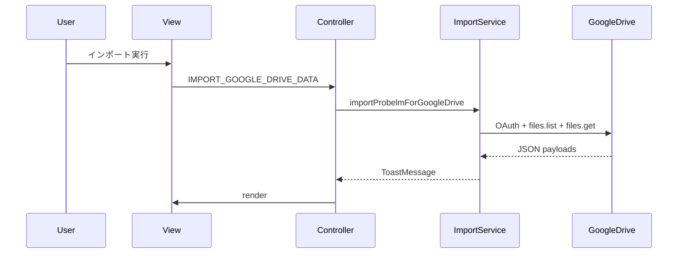

# 🔐 8. 外部連携

## Google Drive 連携概要
1. 設定モーダルで Client ID / Folder ID を入力
2. Google Identity Services でアクセストークンを取得
3. Drive API でフォルダ内 JSON を取得
4. JSON を Question / QList に変換
5. Repository へ保存し、画面を更新

参照: `src/app/api/google_auth.ts:100-167`

## 連携シーケンス


## 関連リンク
- 取得データの保存は [永続化とリポジトリ](./06-永続化とリポジトリ) を参照

## 🔎 参照コード
参照: `src/app/services/import_google_drive_service.ts:11-41`（コメントは説明用に追記）

```ts
// NOTE: トークン取得後に JSON を取得して保存する
export async function importProbelmForGoogleDrive(
  clientId: string,
  folderId: string,
): Promise<ToastMessage> {
  try {
    // Google Identity Services のトークン取得
    const accessToken = await requestAccessTokenWithClientId(clientId);

    // Drive から JSON 群を取得（ショートカット解決・Docs除外・JSONのみ）
    const files = await fetchAllJsonFromFolderStrict(accessToken, folderId);
    if (!files.length) {
      return {
        uuid: crypto.randomUUID(),
        message: "対象フォルダに JSON ファイルが見つかりませんでした。",
        kind: ToastMessageKind.SUCCESS,
      };
    }
```
