# 📂 9. ディレクトリ構造と運用

## ディレクトリ構造（主要）
```
oqoa/
|-- src/
|   |-- app/
|   |   |-- api/
|   |   |-- controllers/
|   |   |-- enums/
|   |   |-- models/
|   |   |-- repositories/
|   |   |-- services/
|   |   |-- storages/
|   |   |-- updates/
|   |   |-- utils/
|   |   |-- views/
|   |   `-- app.ts
|   `-- resources/
|       |-- static/
|       |-- styles/
|       `-- index.html
|-- package.json
|-- tsconfig.json
|-- tailwind.config.js
|-- eslint.config.mjs
`-- README.md
```

## 運用コマンド
- 開発起動: `npm run start`
- ビルド: `npm run build`
- 静的解析: `npm run lint`

詳細は [クイックスタート](./02-クイックスタート.md) を参照してください。

## ビルド/デプロイ
Parcel ビルドは `public/` に出力されるため、GitHub Pages へそのまま配置できます。
参照: `package.json:6-8`

## ビルドフロー

```mermaid
flowchart LR
  A[src/resources/index.html] --> B[parcel build]
  B --> C[public/ 出力]
  C --> D[GitHub Pages 配置]
```


## 🔎 参照コード
参照: `tsconfig.json:2-12`（コメントは説明用に追記）

```jsonc
"compilerOptions": {
  "target": "es6", // 出力ターゲット
  "module": "nodenext", // ESM を前提
  "resolveJsonModule": true, // JSON 読み込み
  "strict": true, // 厳格型チェック
  "esModuleInterop": true,
  "skipLibCheck": true,
  "forceConsistentCasingInFileNames": true,
  "outDir": "./dist",
  "moduleResolution": "nodenext"
}
```
